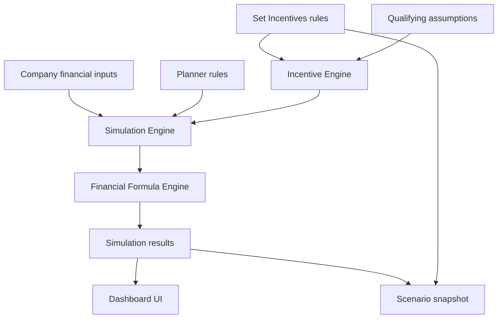

# Architecture Overview

## Purpose

This document defines the production documentation architecture and system boundaries for the CareBearBooks Bonus and Salary Increments Simulation project.

## What Belongs Here

- Source-of-truth rules.
- Major components and their responsibilities.
- Data flow between Set Incentives, simulation inputs, formulas, scenarios, and UI.
- Implementation anchors that help developers and AI coding assistants find the right files.
- Cross-document ownership rules.

Detailed formulas belong in [Financial Formulas](../finance/financial-formulas.md). Database persistence details belong in [Database Design](../data/database-design.md). API boundaries belong in [API Design](../api/api-design.md).

## Source Of Truth Model

Set Incentives is the source of truth for incentive rules, amounts, thresholds, percentages, trigger counts, billing thresholds, time periods, messages, evidence requirements, approval requirements, and formula variables.

Incentive Simulation is a financial testing tool. It reads configured rules and assumptions, then calculates exposure, affordability, sustainability, and projections.

Claims and approvals are business concepts outside the simulator's write scope. The simulator can use approved or qualifying assumptions for planning, but it must not create claims or approvals.

## Component Responsibilities

| Component | Responsibility |
| --- | --- |
| Set Incentives | Stores configurable incentive rules and all rule values. |
| Incentive Engine | Interprets selected rules, payout types, formula variables, and bonus vs salary increment classification. |
| Simulation Engine | Combines financial inputs, planner rules, qualifying assumptions, period conversion, and formula outputs into a scenario result. |
| Financial Formula Engine | Owns deterministic formulas for currency, exposure, affordability, ratios, break-even days, and projections. |
| Scenario Persistence | Saves and loads full simulation scenarios, including rule snapshots. |
| Dashboard UI | Presents inputs, assumptions, charts, result cards, statuses, and advanced projections. |
| API Layer | Provides server boundaries for currency, future scenario persistence, future rule management, and future simulation execution. |

## High-Level Data Flow

## Numeric Runtime Rules

- All internal math should run in KSh.
- USD values must be converted to KSh using the exchange rate before calculation.
- KSh values stay as entered.
- Display values can convert back to USD when the user selects All USD.
- If exchange rate is missing and conversion is needed, status must be "Needs Exchange Rate."
- Never show `NaN`, `Infinity`, `undefined`, or broken values.

## Current Implementation Anchors

| Area | File |
| --- | --- |
| Domain types | `../../src/lib/types.ts` |
| Formula helpers | `../../src/lib/simulation-formulas.ts` |
| Currency helpers | `../../src/lib/currency.ts` |
| Rule helpers | `../../src/lib/incentive-rules.ts` |
| Seeded Set Incentives rules | `../../src/lib/seed-rules.ts` |
| Scenario abstraction | `../../src/lib/scenarios.ts` |
| Simulation page | `../../src/app/incentive-simulation/page.tsx` |
| Set Incentives page | `../../src/app/set-incentives/page.tsx` |
| Currency route | `../../src/app/api/currency/usd-ksh/route.ts` |

## Architecture Guardrails

- Calculation formulas may live in code.
- Formula values must come from Set Incentives, simulation inputs, planner rules, or scenario data.
- Salary increments and bonuses must remain separate in calculations and charts.
- Saved scenarios must store both `rule_id` and the rule snapshot at time of save.
- Optional projections should stay advanced/collapsible, not part of the crowded main dashboard.

## AI Assistant Notes

Before editing implementation, locate the owning document:

- Business behavior: [Business Requirements](../business/business-requirements.md)
- Formulas: [Financial Formulas](../finance/financial-formulas.md)
- Rule interpretation: [Incentive Engine](../engines/incentive-engine.md)
- Simulation orchestration: [Simulation Engine](../engines/simulation-engine.md)
- Persistence: [Database Design](../data/database-design.md)
- UI: [UI/UX Specifications](../product/ui-ux-specifications.md)
